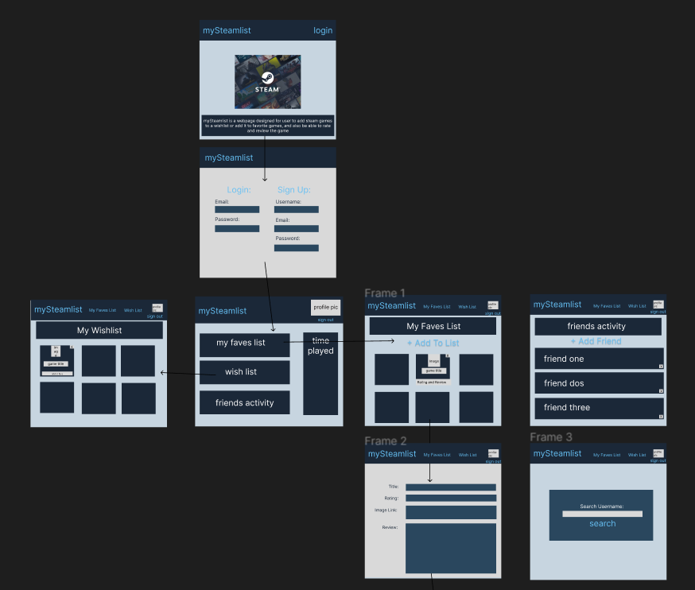

# Project 2: My-Steam-List Interactive Full-Stack Application

## Table of Contents
- [Description](#description)
- [Project Requirements](#project-requirements)
- [Presentation Requirements](#presentation-requirements)
- [User Specifications](#user-specifications)
- [Functionality](#functionality)
- [Snapshots](#snapshots)
- [Deliverables](#deliverables)

## Description

This is an interactive full-stack application showcasing our collaborative skills and coding abilities, this particular project is a focal point of our portfolio. 

## Project Requirements

This project will to create a real-world full-stack application that we will be able to showcase to potential employers. 

The project fulfills the following requirements:

* Uses Node.js and Express.js to create a RESTful API.

* Uses Handlebars.js as the template engine.

* Uses MySQL and the Sequelize ORM for the database.

* Has both GET and POST routes for retrieving and adding new data.

* Uses at least one new library, package, or technology that we haven’t discussed in class. 
  We used Materialize - a modern responsive front-end framework based on Material Design

* Has a folder structure that meets the MVC paradigm.

* Includes authentication (express-session and cookies).

* Protects API keys and sensitive information with environment variables.

* Is deployed using Heroku (with data).

* Has a polished UI.

* Is responsive.

* Is interactive (i.e., accept and respond to user input).

* Meets good-quality coding standards (file structure, naming conventions, follows best practices for class/id naming conventions, indentation, quality comments, etc.).

* Has a professional README (with unique name, description, technologies used, screenshot, and link to deployed application).

## Presentation Requirements

The group presentation includes the following concepts:

* An elevator pitch: a one minute description of our application

* The concept: What is our user story? What was the motivation for development?

* The process: What were the technologies used? How were tasks and roles broken down and assigned? What challenges were encounter? What were the successes?

* Demo: We showed all the features of our website.

* Directions for Future Development

## User Specifications

The user would like a webpage designed to be able to add Steam games to a wishlist or add to favorite games, and also be able to rate and review the games.

## Functionality
The user is presented with a home page that allows the user to securely sign up login in.

A first time user will sign up with a user name, email address and password, that will be encrypted.  After sign up, the user can login with their email and password.

After login, the user is presented with a page that contains the following options: my faves list, wish list, and the option to sign out.

The Wishlist page presents an image, game title, and price of each of the users selected wishlist items.  The user can also navigate to the My Faves List or sign out.

The My Faves List  presents an image, game title, rating and review of all of the users selected favorite games.  The user can also navigate to the Wishlist or sign out.

While in the My FAves List the user can click on an image and a Review Page will be presented where the user will be presented with the title, rating and image and the user can write a review.

## Snapshots
  

## Deliverables

Each member of the group submitted the following for review:

The URL of the deployed application to heroku:

The URL of the GitHub repository:  https://github.com/dawn-kline-m/My-Steam-List
